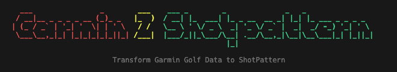

# 🏌️ Garmin2ShotPattern




Transform Garmin golf shot data into ShotPattern app format with an easy-to-use command-line interface.
Tired of manual CSV edits? This tool automates the process! Just hit some shots with your Garmin Launch Monitor on the driving range, export the data, and let Garmin2ShotPattern handle the rest.

## ✨ Features
- 🪄 **Setup Wizard** - Interactive configuration for your specific clubs and data format
- 📁 **Easy file selection** - Browse and select Garmin CSV files with cursor navigation
- ⛳ **Club mapping** - Map your Garmin club names to ShotPattern identifiers
- 📏 **Unit support** - Configure meters/yards for distance and meters/feet/yards for deviation
- 🎯 **Shot type configuration** - Define whether shots are tee shots or approach shots
- 🎨 **Beautiful interface** - Clean, colorful terminal UI with interactive prompts
- 📊 **Data validation** - Shows club statistics and mapping status before transformation
- ✂️ **Shot review** - Review and optionally remove specific shots before export

## 🚀 Quick Start

### Prerequisites

- Python 3.11 or higher
- pip (Python package installer)
- make (optional, if you are familiar with python virtual environments)

### Setup

- Python 3.11 or higher
- pip (Python package installer)
- make (optional, if you are familiar with python virtual environments)

#### Setup Environment
(skip if you prefer manual setup)

```bash
make setup
```

This will:
- Create a virtual environment
- Install all required dependencies
- Prepare the application for use

#### First Time Configuration

Before transforming data, run the setup wizard to configure your club mappings:

```bash
make configure
# or
python setup_wizard.py
```

This interactive wizard will:
1. Ask for your preferred units (meters/yards, meters/feet/yards)
2. Map columns in your Garmin CSV files
3. Map your specific Garmin clubs to ShotPattern club identifiers
4. Set default total distances for each club. This will be used as the target to calculate shot deviation.
5. Save configuration to `config.json`

You can re-run the wizard anytime to update your configuration.

#### Running the Application

```bash
make run
```

Or manually:
```bash
# Activate virtual environment
source venv/bin/activate

# Run the application
python transform.py
```

#### Available Make Commands

```bash
make help      # Show all available commands
make setup     # Create virtual environment and install dependencies
make configure # Run setup wizard to configure club mappings
make run       # Run the application
make clean     # Remove cache files
make install   # Install/update dependencies only
```

## 📁 Project Structure

```
garmin2shotpattern/
├── transform.py              # Main CLI application
├── setup_wizard.py          # Configuration wizard
├── enums.py                 # ShotPattern club identifiers
├── config.json              # User configuration (generated by setup)
├── requirements.txt         # Python dependencies
├── Makefile                 # Build automation
├── data/
│   ├── garmin/              # Place Garmin CSV files here
│   ├── output/              # Transformed CSV files
│   └── template/            # Template file
└── README.md               # This file
```

## ⚙️ Configuration

### Configuration File (config.json)

The `config.json` file is generated by running `make configure` and stores your personal setup:

It will handle the column mapping as the Garmin Application has localized column headers.

```json
{
  "units": {
    "distance": "meters",
    "deviation": "meters"
  },
  "column_mapping": {
    "Club": "Schlägername",
    "Total": "Gesamtstrecke",
    "Side": "Gesamtabweichungsdistanz"
  },
  "club_mappings": {
    "Stealth I7": "7i",
    "Stealth I8": "8i",
    "Stealth AW 49°": "GW"
  },
  "target_distances": {
    "7i": "150",
    "8i": "140",
    "GW": "110"
  }
}
```

**Configuration Options:**

- `units.distance`: Display unit for distances ("meters" or "yards")
- `units.deviation`: Display unit for deviations ("meters", "feet", or "yards")
- `column_mapping`: Maps ShotPattern columns to your Garmin CSV column names
- `club_mappings`: Maps your specific Garmin club names to ShotPattern identifiers
- `target_distances`: Default target distance for each club

### ShotPattern Club Identifiers

The `shotpattern_enums.py` file contains all valid ShotPattern club identifiers:

**Drivers & Woods:**
- `Dr` (Driver)
- `2W`, `3W`, `4W`, `5W`, `7W`, `9W`, `11W`, `13W`, `15W`

**Hybrids:**
- `1Hy`, `2Hy`, `3Hy`, `4Hy`, `5Hy`, `6Hy`, `7Hy`, `8Hy`, `9Hy`, `10Hy`, `11Hy`, `12Hy`, `13Hy`, `14Hy`, `15Hy`

**Irons:**
- `1i`, `2i`, `3i`, `4i`, `5i`, `6i`, `7i`, `8i`, `9i`, `10i`, `11i`

**Wedges:**
- `PW` (Pitching Wedge)
- `GW` (Gap Wedge)
- `SW` (Sand Wedge)
- `LW` (Lob Wedge)
- `48°`, `49°`, `50°`, `51°`, `52°`, `53°`, `54°`, `55°`, `56°`, `57°`, `58°`, `59°`, `60°`, `61°`, `62°`, `63°`, `64°`

**Putter:**
- `Putter`

## 🎮 Usage

1. **Create some data!**
    - Run a Driving Range session in the Garmin Golf app
    - Hit shots with your clubs to your default target distances of that club.
    - Export the session data as a CSV file and place it in the `data/garmin/` folder.

2. **Run setup wizard** (first time): `make configure`
    - Select your preferred units
    - Choose a sample Garmin CSV file
    - Map your clubs to ShotPattern identifiers
    - Set target distances for each club

2. **Transform data**: `make run`
    - Select a Garmin CSV file to transform
    - Review detected clubs and their mapping status
    - Configure shot types (Tee/Approach) for each club
    - Review and optionally remove specific shots
    - Export to ShotPattern format

3. **Import to ShotPattern app**
    - Find the transformed CSV in `data/output/`
    - Import into the ShotPattern mobile app

## 🛠️ Technical Details

### Dependencies

- **pandas**: Data manipulation and CSV processing
- **click**: Command-line interface framework
- **rich**: Beautiful terminal formatting
- **InquirerPy**: Interactive prompts with cursor navigation

### Data Format

**Input (Garmin CSV):**
- Must contain club name column (configurable)
- Should have distance and deviation columns (configurable)
- First row after headers contains units (automatically skipped)

**Output (ShotPattern format):**
- Club: Mapped club identifier (7i, 8i, GW, etc.)
- Type: "Tee" or "Approach"
- Target: Target distance in meters
- Total: Total distance measurement
- Side: Side deviation measurement

## 🤝 Contributing

Contributions are welcome! Please open issues or pull requests for bug fixes, enhancements, or new features.

## 📝 License

MIT License - see the [LICENSE](LICENSE) file for details.

Copyright (c) 2025 Bastian Winkler

## 🐛 Troubleshooting
**"Python 3 is not installed"**
- Install Python 3.11+ from [python.org](https://www.python.org/downloads/)

**"Virtual environment not found"**
- Run `make setup` first to create the environment

**"config.json not found"**
- Run `make configure` to generate your configuration file

**"No Garmin CSV files found"**
- Ensure CSV files are in the `data/garmin/` folder
- Check that files have `.csv` extension

**"make: command not found"**
- macOS: Install Xcode Command Line Tools with `xcode-select --install`
- Linux: Install build-essential with `sudo apt-get install build-essential`

## 💡 Tips

- Run `make configure` first to set up your club mappings and units
- Keep all your Garmin CSV files in `data/garmin/` for easy access
- Re-run `make configure` anytime to update your configuration
- The setup wizard remembers your previous settings as defaults
- Shot type configuration (Tee/Approach) is done per transformation
- Review the statistics table to catch any data issues
- Use the shot review feature to remove outliers before export
- `config.json` stores your personal settings - don't commit it to version control
- Use `make help` to see all available commands

---

Made with ⛳ for better golf shot analysis
